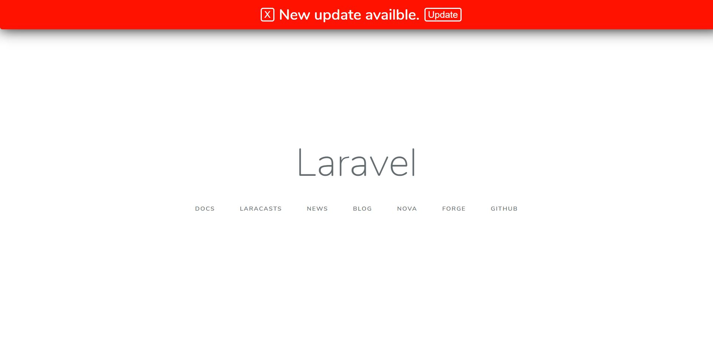
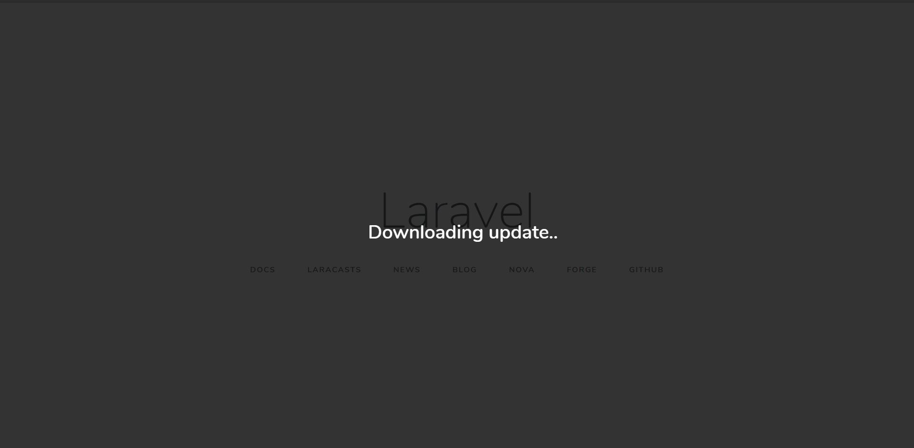

# Easy update laravel web application

[](https://packagist.org/packages/amir9480/laravel-auto-update)
[](https://packagist.org/packages/amir9480/laravel-auto-update)

This package help you make update functionality easily.



## Installation

### Step1: Install the package via composer :

```bash
composer require amir9480/laravel-auto-update
```

### Step2: Publish config files :
```bash
php artisan vendor:publish --provider=LaravelAutoUpdate\LaravelAutoUpdateServiceProvider --tag=config
```

### Step3: Add `APP_VERSION` to .env :
```env
...
APP_URL=http://localhost
APP_VERSION=1.0.0
...
```
### Step4: Upload zip file of your project to your host :
Recommended Directories/files to add to zip file.
* app
* config
* database
    * migrations
* public
* resources
    * lang
    * views
* routes


### Step5: Create json information file in your webhost :
```jsonc
{
    "version": "1.0.1", // Your uploaded zip version
    "file": "test.zip" // Your zip file name or url of zip file
}
```

### Step6: Add json file url to config/laravelautoupdate.php :
```php
'info_file' => 'http://github.com/test.json',
```

### Step7: Add javascript code to your views master page :
```blade
<script src="https://code.jquery.com/jquery-3.4.0.min.js"></script>
<script src="{{ asset('_laravel-auto-update/updater.js') }}"></script>
```
Do not forget add JQuery before updater script.

### Step8: Open your project in browser :


## Configuration
### middlewares:
Array of middlewares to authorize updates only by admins.
### before_update_commands:
Array of commands to run before update. it is recommended to use [spatie/laravel-backup](https://github.com/spatie/laravel-backup) and add `artisan backup:run` to get backup before update.
### after_update_commands:
Array of commands to run after application updated.

**Note: If you define command like `artisan xx` then `Artisan::call` will used otherwise `shell_exec` will used to run commands.**
[read more](https://laravel.com/docs/5.8/artisan#programmatically-executing-commands)

### enabled:
You can disable updates for one project via add
```env
LARAVEL_AUTO_UPDATE_ENABLED=false
```
to .env file.

### temp_path:
Path to save downloading zip.

## Cusomization.
If you want to translate/customize text:
```bash
php artisan vendor:publish --provider=LaravelAutoUpdate\LaravelAutoUpdateServiceProvider --tag=translations
```
and then checkout `resources/lang/vendor/laravel-auto-update`.

Or if you want to customize styles/scripts:
```bash
php artisan vendor:publish --provider=LaravelAutoUpdate\LaravelAutoUpdateServiceProvider --tag=views
```
and then checkout `resources/views/vendor/laravel-auto-update`.


## License

The MIT License (MIT). Please see [License File](LICENSE.md) for more information.

## Laravel Package Boilerplate

This package was generated using the [Laravel Package Boilerplate](https://laravelpackageboilerplate.com).
